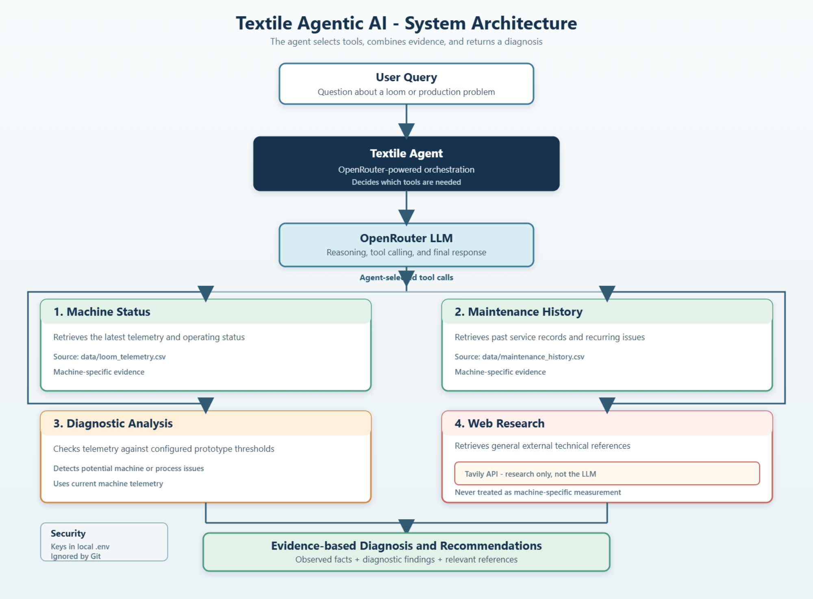

# Textile Agentic AI

An agentic AI system for textile and loom manufacturing. The system investigates
machine conditions by combining current loom telemetry, maintenance history,
rule-based diagnostic analysis, and targeted external technical research. An
OpenRouter-hosted LLM decides which tools are needed and produces the final
evidence-based response.



## Architecture and workflow

The agent follows this workflow. Tool selection is decided by the agent based
on the user's question and the evidence required:

```text
User Query
	|
	v
OpenRouter LLM / Agent
	|
	v
Tool Selection
	|-- Machine Status
	|-- Maintenance History
	|-- Diagnostic Analysis
	`-- Tavily Web Research
	|
	v
Evidence-based Analysis
	|
	v
Final Diagnosis / Recommendations
```

The machine-specific tools use the local CSV data files. Web research supplies
general external technical references; it must not be treated as a machine
measurement or maintenance record.

## API services

These services have separate responsibilities:

### OpenRouter API

- Provides the LLM used for agent reasoning.
- Handles the agent's tool-calling loop and generates the final response.
- Requires `OPENROUTER_API_KEY`.
- The selected model is configured with `OPENROUTER_MODEL`.

OpenRouter is the reasoning and orchestration service. It is not the source of
the local machine data.

### Tavily API

- Is used independently by the web research tool.
- Retrieves external technical information related to textile and loom
  manufacturing problems.
- Requires `TAVILY_API_KEY`.

Tavily is a web search/research service only. It is not the LLM and does not
provide the agent's reasoning. The agent uses Tavily results as general
technical reference information alongside machine-specific evidence.

## Tools

| Module | Purpose |
| --- | --- |
| `tools/machine_tools.py` | Retrieves the latest loom telemetry and operating status from `data/loom_telemetry.csv`. |
| `tools/maintenance_tools.py` | Retrieves maintenance records and recurring issues from `data/maintenance_history.csv`. |
| `tools/diagnostic_tools.py` | Analyzes current machine telemetry against configured prototype thresholds and detects potential issues. |
| `tools/research_tools.py` | Performs external web research through Tavily. |

The agent also includes a root-cause analysis tool that correlates current
telemetry, maintenance history, diagnostic findings, and targeted research.

## Security and environment configuration

API keys are stored locally in a `.env` file and are not committed to GitHub.
Create your own `.env` file in the repository root using `.env.example` as the
template. At minimum, provide your own values for:

```dotenv
OPENROUTER_API_KEY=
OPENROUTER_MODEL=
TAVILY_API_KEY=
```

Do not place real keys in `README.md`, `.env.example`, source files, or test
fixtures. The included `.gitignore` excludes `.env` from version control.

## FastAPI backend

Install dependencies from `requirements.txt`, then start the backend from the
repository root:

```powershell
uvicorn app.api.main:app --reload
```

Interactive API documentation is available at `http://127.0.0.1:8000/docs`.

The backend reuses the existing machine tools, root-cause analysis, and
OpenRouter agent. Local frontend origins are allowed by default through
`CORS_ORIGINS` in `.env`; production deployments should set that variable to
their explicit frontend origins rather than using `*`.

## React frontend

From the `frontend` directory:

```powershell
npm install
npm run dev
```

The dashboard runs at `http://127.0.0.1:5173/` and uses
`frontend/.env.example` for the backend URL and non-secret loom list. It never
contains OpenRouter or Tavily credentials.

## Phase 6 advanced AI

The `tools/advanced_analysis_tools.py` orchestration combines current
telemetry, historical telemetry, maintenance records, the existing diagnostic
tool, web-backed root-cause analysis, and explainable prediction modules.

- **Anomalies:** each metric is compared with the prior historical median. The
	score increases with deviation relative to historical spread and is raised
	when a configured prototype threshold is breached.
- **Trends:** first-to-latest relative change is classified as improving,
	stable, or deteriorating using a 3% stability band.
- **Maintenance risk:** LOW, MEDIUM, or HIGH is a rule-based estimate using
	severe anomalies, deteriorating trends, current status, and recurring
	maintenance records.
- **Production forecast:** a one-step estimate from the historical production
	slope with observed variation reported as uncertainty.
- **Failure risk:** named failure modes receive transparent evidence scores
	from current thresholds, anomalies, trends, and relevant maintenance text.

The analysis requires current telemetry and at least three historical readings
for reliable trend and prediction output. With less data it returns
`Insufficient historical data for reliable prediction.` No synthetic training
data is created. Scores and confidence values are evidence-based indicators,
not probabilities, guarantees, or exact failure dates. The small CSV dataset,
prototype thresholds, and simple rules should eventually be replaced by
OEM-specific baselines and production-grade, labeled time-series models.
